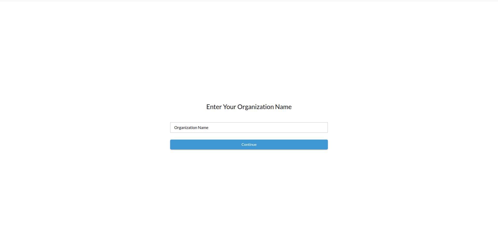
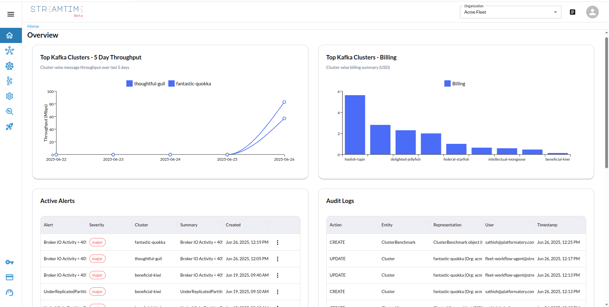
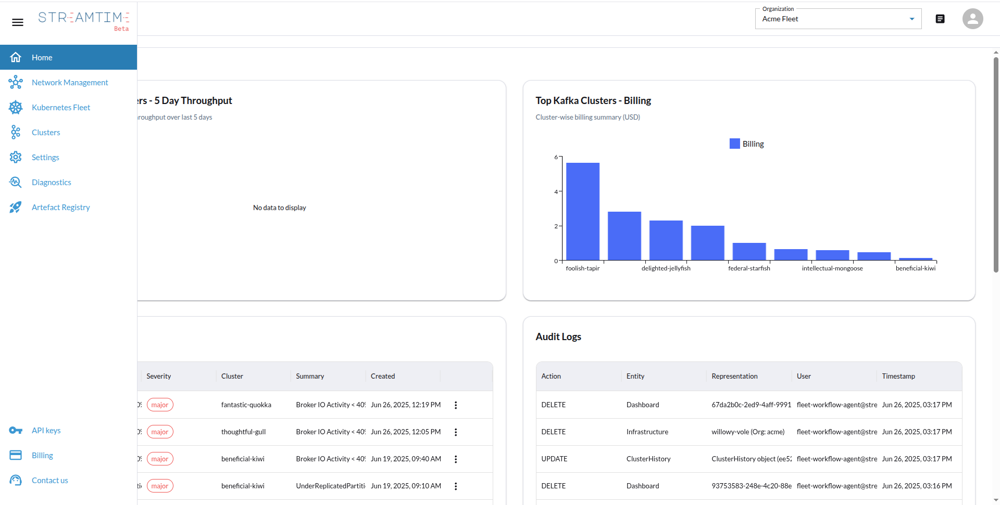
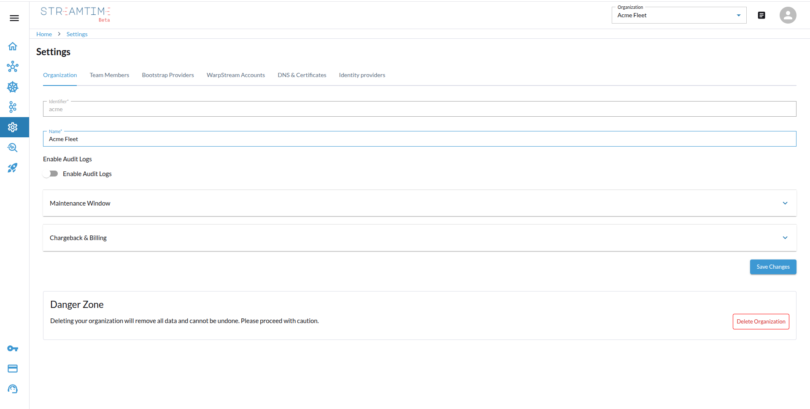
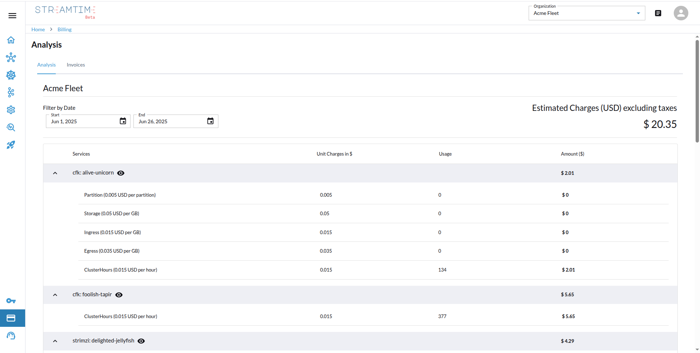
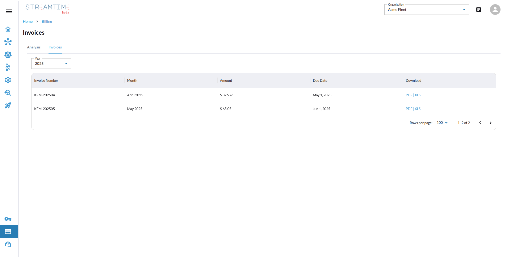

# Get Started

Once access is granted, users will be prompted to enter their **organization name**.

After login via OIDC, users are redirected to the **Streamtime Console Home Page**.

##  Console Overview

Key dashboard widgets available on the homepage:

-  Cluster Throughput (last 5 days)
-  Top Kafka Clusters - Billing
-  Active Alerts 
-  Audit Logs
-  Kubernetes Fleet Status:
  - Total, Healthy, Provisioning, Unhealthy
-  Kafka Clusters Status:
  - Total, Healthy, Provisioning, Unhealthy

  

##  Navigation Menu

The sidebar includes the following pages:

- Network Management
- Kubernetes Fleet
- Clusters
- Settings
- Diagnostics
- Artifact Registry
- API Keys
- Billing

---

##  Settings Page

Tabs available:

- Organizations
- Team Members
- Bootstrap Providers
- Warpstream Accounts
- DNS & Certificates
- Identity Provider Management

  

## Billing Page

The **Billing** section is divided into two tabs:

### 1. Current Month Analytics

Provides visual insight into the current month’s usage and billing metrics.

- Kafka Units by Cluster
- Cluster Hours
- Cost
- Total Usage
- Service-Wise Breakdown

  

---

### 2. Invoices

The invoices tab allows users to view, download, or share monthly invoices.

- Table listing:
  - Invoice Date
  - Billing Period
  - Amount
  - Payment Status
  - Download PDF
  - Share Link

  
