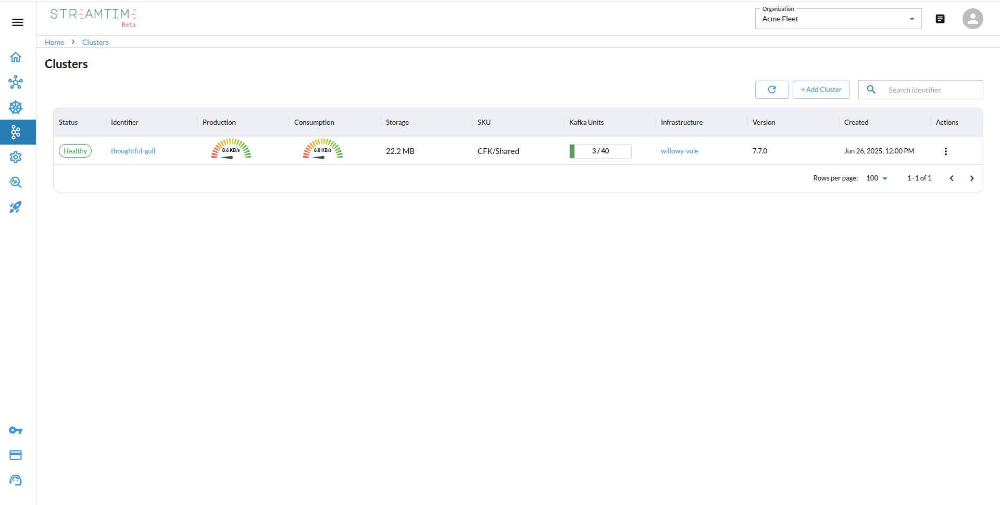
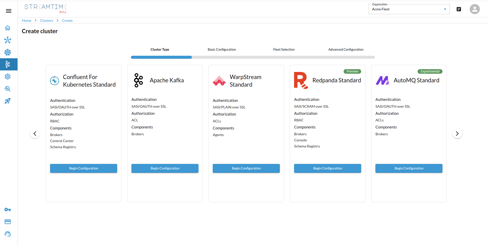
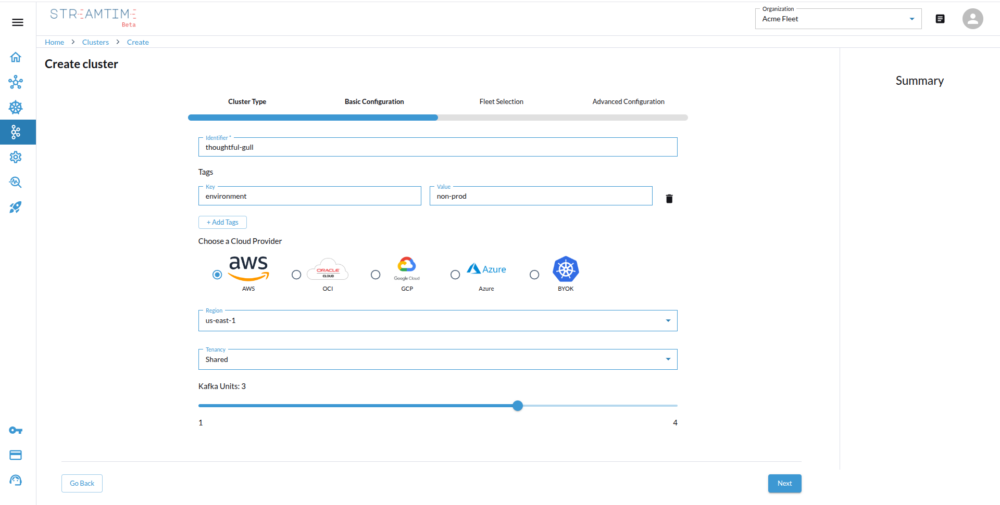
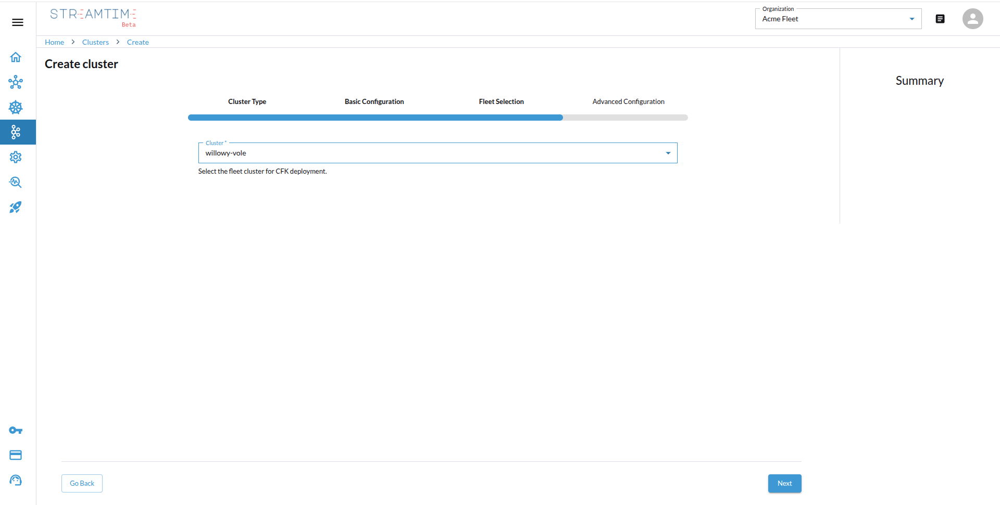
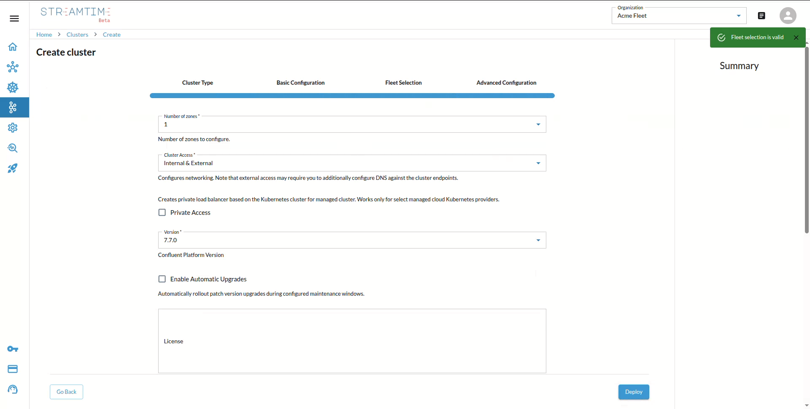
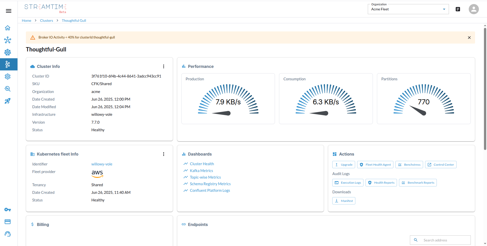

# Kafka Clusters

The cluster list shows:

- Table view of clusters
-  **Create Cluster** button (top right)
-  Search input

---

##  Creating a Kafka Cluster

Cluster creation follows 4 steps:

### Step 1: Cluster Type

Choose type:

- Confluent for Kubernetes Standard
- Apache Kafka
- Warpstream Standard
- Redpanda Standard
- Automq

  

---

### Step 2: Basic Configuration

- Identifier Name
- Tags
- Cloud Provider (AWS, OCI, GCP, Azure, BYOK)
- Regions
- Tenancy Mode
- Kafka Units

  

---

### Step 3: Fleet Selection

- Select Kubernetes Fleet (filtered by Basic Config)

  

---

### Step 4: Advanced Configurations

- Number of Zones
- Cluster Access: `internal`, `external`
- Kafka Version
- Enable Auto-Upgrades
- Auth Provider & Group
- Tiered Storage:
  - Bucket Name
  - Object Storage Account

  

---

##  Cluster Detail View

Includes:

- **Cluster Info**: Identifier, SKU, Version, Status
- **Fleet Info**: Identifier, Fleet Provider, Status
- **Performance Charts**:
  - Production
  - Consumption
  - Partitions
- **Dashboards**:
  - Cluster Health
  - Kafka Metrics
  - Topic-wise Metrics
- **Actions**:
  - Health Agents
  - Benchstress
  - Execution Logs
  - Health & Benchmark Reports
- **Billing**: Cost charts
- **Endpoints**:
  - Prometheus URL
  - Bootstrap Servers
  - Loki URL

  
