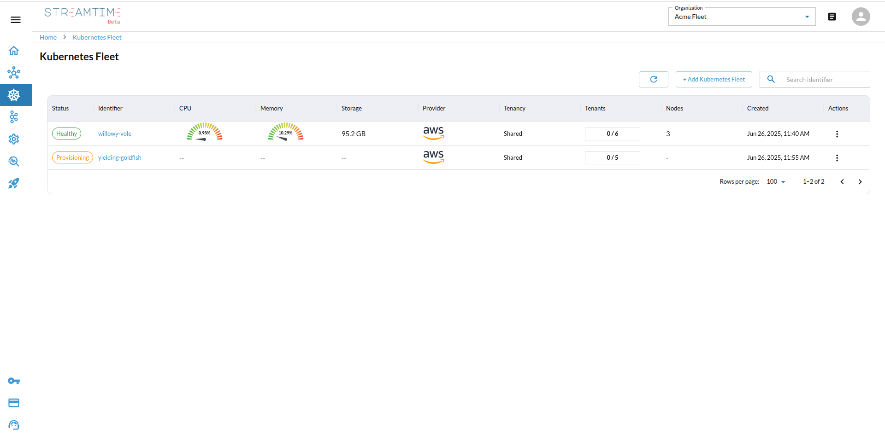
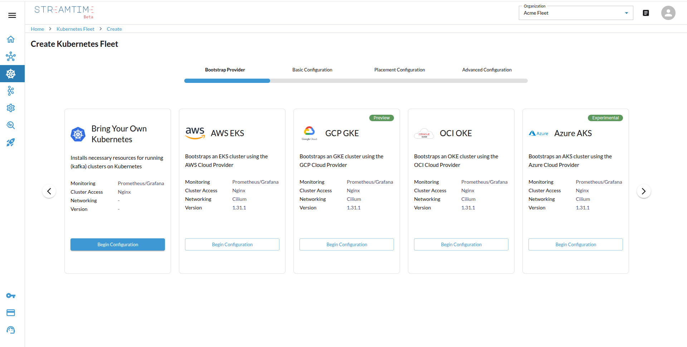
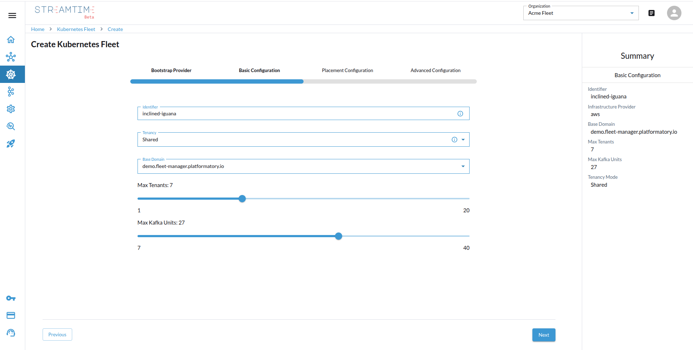
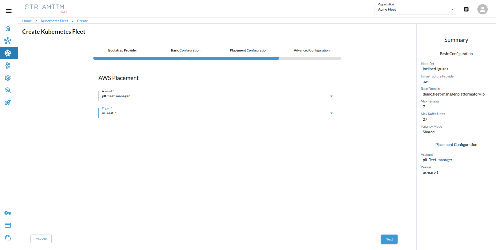
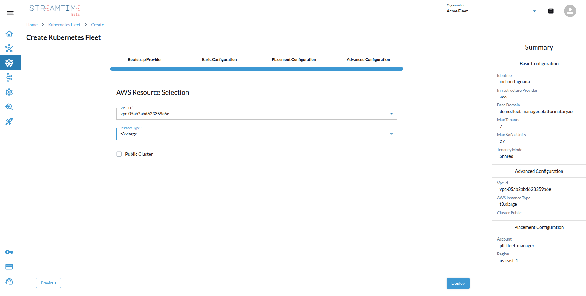
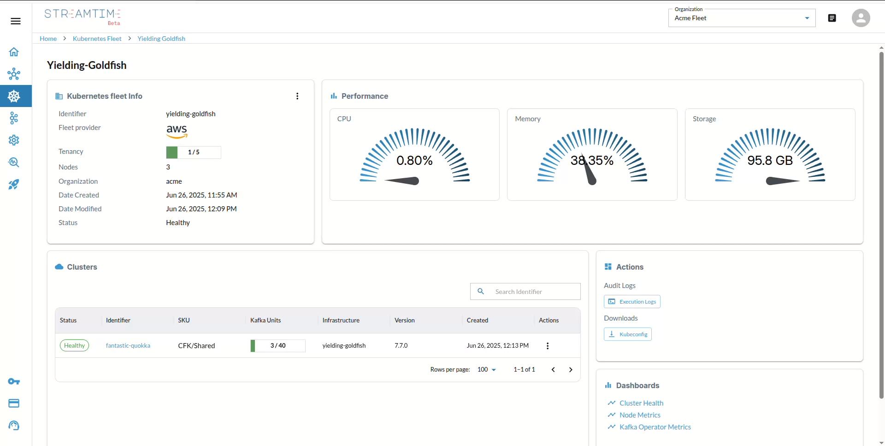

# Kubernetes Fleet

The fleet overview page displays a list of all Kubernetes Fleets.

-  Top-right: **Create Fleet** button
-  Search input
-  Delete action per row

---

##  Creating a Kubernetes Fleet

Fleet creation is a 4-step form:

### Step 1: Bootstrap Provider

Choose from:

- Bring Your Own Kubernetes
- AWS EKS
- GCP GKE
- OCI OKE
- Azure AKS

---

### Step 2: Basic Configuration

- Tenancy Mode: `shard`, `dedicated`, `isolated`
- DNS Selection
- Max Tenants
- Max Kafka Units (1 unit = 20MBps throughput)
- Identifier (slug)

---

### Step 3: Placement Configuration

- Select Cloud Account (depends on provider)
- Choose Region

---

### Step 4: Advanced Configurations

- VPC ID
- Instance Type

---

##  Fleet Detail View

- General Info:
  - Identifier, Provider, Tenancy, Status
- Performance Charts:
  - CPU, Memory, Storage
- Cluster List (linked to fleet)
- Actions:
  - Execution Logs
  - Kubeconfig
- Dashboards:
  - Cluster Health
  - Node Metrics
  - Kafka Operator Metrics

